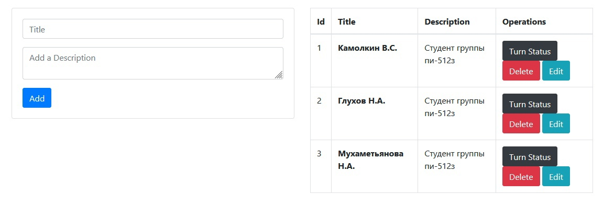

# Example Python Flask Crud

Простой пример реализацию CRUD-операций на языке python с фреймворком flask.
 
## Screenshots


  
 
 
### Installing (для Linux)

откройте терминал и выполните следующие команды


```
git clone https://github.com/STUDENT211/ToDo-Python-CRUD.git
```
```
cd example-flask-crud/
```
```
python3 -m venv venv
```
```
source venv/bin/activate
```
```
pip install --upgrade pip
```
```
pip install -r requirements.txt
```
```
export FLASK_APP=crudapp.py
```
```
flask db init
```
```
flask db migrate -m "entries table"
```
```
flask db upgrade
```
```
flask run
```

## License

This project is licensed under the MIT License - see the [LICENSE](LICENSE) file for details
